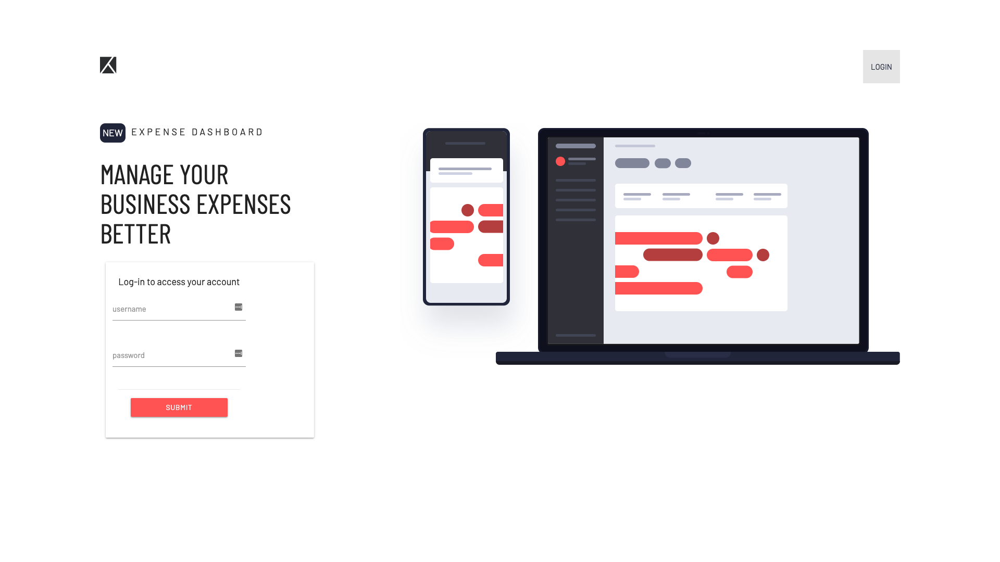
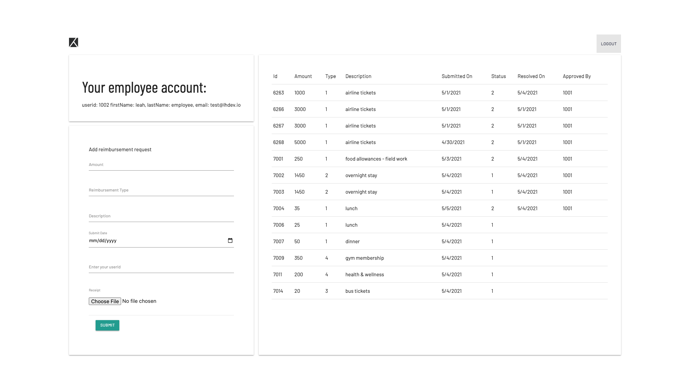
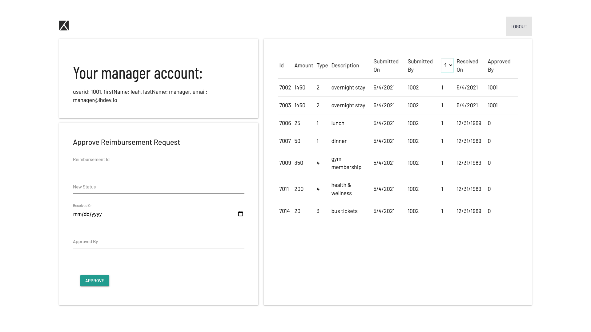

# ERS - Employee Reimbursement System

The Expense Reimbursement System(ERS) will make it easier for both employees and HR to handle company reimbursement 
requests. Both the employee and manager will be able to view reimbursement submissions.
The employee will also be able to submit a new request. The HR manager will be able to filter/sort through 
these requests by status. He/she will be able to approve or deny such requests.

### Technologies Used
- Java 8
- MariaDB
- Javalin
- JavaScript
- HTML
- CSS
- Logback
- JUnit

### Features
- Employee will be able to login/logout
    1. view their account information 
    2. able to view past reimbursement requests
    3. able to add new reimbursement request
- Manager will be able to login/logout
    1. able to view all reimbursement requests
    2. able to filter these request by status
    3. able to approve/deny request
  

  

### Getting Started

1. From terminal, cd to directory where project will be located
2. git clone repository
``git clone https://github.com/leah-h/ERS-BackEnd.git``
3. ``mvn clean``   
4. ``mvn package``
5. ``mvn exec:java -Dexec.mainClass=io.lhdev.ersbackend.Application``
6. From your browser go to ``http://localhost:7000``

Landing Page View:

Employee View:

Manager View Sorted By Status: 

### License
This project uses the following license: <[GNU General Public License](LICENSE)>.

